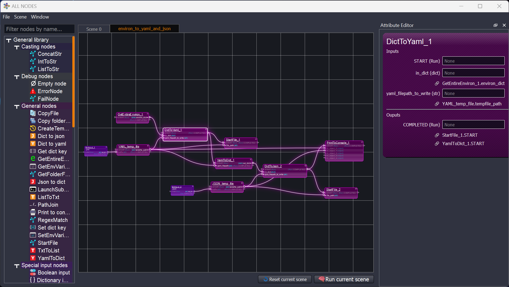

# all_nodes
Node editor to be used cross-platform.

## Preview

## Folder structure example
Example of organization of a folder, that contains two libraries

| Folder structure                      | Classes representation                   | Scenes                                |
|---------------------------------------|------------------------------------------|---------------------------------------|
|  |  |  |                              

Each library can have as many modules as needed, and can have an 'icons' folder to provide icons for the classes contained in the modules.
